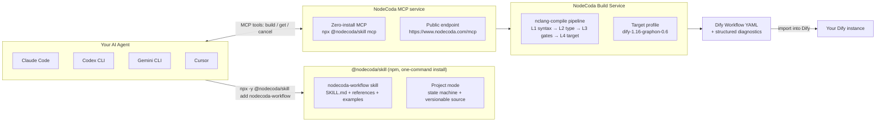

# NodeCoda — Workflow Engineering, Upgraded for the AI Era

> **从需求到可版本化的 Dify 工作流——全程由你的 AI 代理完成。**

[](https://www.npmjs.com/package/@nodecoda/skill)
[](LICENSE)
[](https://www.nodecoda.com)
[](https://www.nodecoda.com)
[]()

**NodeCoda** 是一个 AI 原生的工作流工程平台。别人在画布上拖节点，NodeCoda 让工作流变成**可版本化的源码**（`.ncoda`）——由你的 AI 代理编写，编译成生产可用的 **Dify Workflow YAML**。

本仓库是 NodeCoda 的 **Agent 分发层**：一条命令，把 `nodecoda-workflow` skill 装进任何编码代理（Claude Code、Codex CLI、Gemini CLI、Cursor），并自动接好 NodeCoda MCP 服务。你的代理从此多了一项技能：**用写代码的方式做工作流工程**。

[🚀 立即体验 → www.nodecoda.com](https://www.nodecoda.com)

---

## Why NodeCoda?

| 传统拖拽式工作流 | NodeCoda 方式 |
|---|---|
| 画布/配置不可 diff、不可 review | Source 是纯文本，天然进 git，走 PR review |
| 团队协作靠截图、口头同步 | 协作靠 diff、review、分支、回滚 |
| 出错只能人工点查 | **结构化诊断** + 自动修复循环 |
| 每次改动推倒重来 | 改几行 Source，重新编译即得新 artifact |

一句话：**把工作流从"画图"变成"写代码"，AI 才能成为你的工作流工程师。**

## How it works

```
你的 AI 代理 ──► nodecoda-workflow skill ──► NodeCoda MCP ──► 编译流水线 ──► Dify Workflow YAML
```



**链路说明**：代理按 skill 的规范，把需求写成 `.ncoda` 源码 → 通过 MCP 提交异步构建 → 编译流水线做 L1→L4 校验并产出目标 Dify 工作流 → 结构化诊断驱动修复循环，直到交付可导入 Dify 的 artifact。

## Install

### Option A — one command (recommended)

```bash
npx -y @nodecoda/skill add nodecoda-workflow
```

`@nodecoda/skill` 会自动探测当前项目使用的代理（Codex / Claude Code / Gemini CLI / Cursor）并落位到正确的 skill 路径。

### Option B — manual clone

```bash
git clone https://github.com/nodecoda/nodecoda-skill.git

# Claude Code
cp -R nodecoda-skill/skills/nodecoda-workflow ~/.claude/skills/

# Codex CLI（项目级）
cp -R nodecoda-skill/skills/nodecoda-workflow .codex/skills/

# 任何遵循 Claude Code skill 约定的代理
cp -R nodecoda-skill/skills/nodecoda-workflow <skill-search-path>/nodecoda-workflow
```

### 接入 MCP

- **零安装**：`npx -y @nodecoda/skill mcp`（stdio / `--http` Streamable HTTP），按需拉起，无需 clone
- **公网直连**：`https://www.nodecoda.com/mcp`，Key 从 `NODECODA_KEY` 环境变量读取，绝不落盘到配置
- **自托管/本地开发**：`.codex/config.example.toml` 提供 local HTTP、local dev stack、stdio bridge 三种模板

详细目标路径与 Cursor 的 `.mdc` 规则见 [docs/installation.md](docs/installation.md)。

## Quick start

```bash
# 1. 安装 skill（自动探测 Codex / Claude Code / Gemini / Cursor 并落位）
npx -y @nodecoda/skill add nodecoda-workflow

# 2. 配置 API Key
export NODECODA_KEY=sk-...   # 写入你的 shell profile

# 3. 直接吩咐你的代理，例如：
#    "Build me a workflow: take a user query and answer with GPT-5.4"
```

就是这么简单——skill 装好、MCP 接好之后，你的代理知道何时、如何调用
`build_dify_workflow` / `get_workflow_build` / `cancel_workflow_build`，
并在构建失败时根据诊断自行修复。

> **零安装 MCP**：`npx -y @nodecoda/skill mcp` 按需拉起 MCP server（stdio / Streamable HTTP），无需 clone、无需本地安装。详细配置见 [docs/installation.md](docs/installation.md)。

## What the skill gives your agent

- **3 个 MCP 工具**：`build_dify_workflow`、`get_workflow_build`、`cancel_workflow_build`
- **项目化工作流（Project Mode）**：一个工作流 = 一个目录，`nodecoda.yaml` + `nodecoda.state.json` + `src/*.ncoda`，状态机 `INIT → CLARIFYING → DESIGNED → SOURCE_READY → BUILDING → SUCCEEDED`，会话中断可恢复、`builds/` 可复现
- **结构化诊断**：L1→L4 每个阶段都贡献机器可读的诊断，修复循环 ≤5 次收敛
- **凭据安全**：Key 只存在于 MCP 客户端配置，绝不出现在源码、prompt 或 artifact 中

示例源码（`.ncoda`，`examples/` 下有 4 个可运行示例）：

```nodecoda
@language nodecoda/1
@mode workflow

// 经典 "main → llm → return" 模式
const MODEL = "openai_api_compatible/gpt-5.4";

function main(string query) -> string {
    let response = llm(MODEL, {
        "messages": [
            { "role": "system", "content": "你是一个简洁的助手，用一句话回答用户问题。" },
            { "role": "user", "content": query }
        ]
    });
    return response.text;
}
```

## Repository layout

```
nodecoda-skill/
├── skills/nodecoda-workflow/   # 唯一对外发布的 skill
│   ├── SKILL.md                # 代理遵循的工作流协议
│   ├── manifest.json           # 版本、平台、target profile、MCP 工具声明
│   ├── references/             # 8 篇深度知识（语言规范、诊断、故障模式…）
│   └── examples/               # 4 个可运行的 .ncoda 示例
├── docs/                       # 安装与设计文档
├── scripts/                    # CLI / MCP server / 项目管理工具
├── .github/workflows/          # CI（validate + test）+ tag 驱动发布
├── package.json                # @nodecoda/skill（npm）
├── LICENSE                     # Apache License 2.0
└── NOTICE
```

## Compatibility

| 项 | 值 |
|---|---|
| Skill 版本 | `0.2.7`（独立于 NodeCoda core 版本） |
| NodeCoda core | `>= 1.0.0`（`min_nodecoda`） |
| 目标 profile | `dify-1.16-graphon-0.6` |
| 支持代理 | Claude Code、Codex CLI、Gemini CLI、Cursor（遵循 Claude Code skill 约定的代理均可） |
| 语言 | NodeCoda Source（`@language nodecoda/1`） |

发布流水线由 **git tag 驱动**：`git tag v0.2.7 && git push origin v0.2.7`，workflow 会校验 tag 与 `manifest.json` 版本一致后发布 npm。

## Contributing

见 [CONTRIBUTING.md](CONTRIBUTING.md)。简要约定：

- **改 skill 内容** — 编辑 `skills/nodecoda-workflow/`，bump `manifest.json` version，更新 `CHANGELOG.md`
- **新增 skill** — 在 `skills/<new-skill>/` 下创建，附 `SKILL.md` + `manifest.json`；先开 issue 讨论

## Ecosystem

| 仓库 | 用途 |
|---|---|
| [nodecoda/nodecoda-skill](https://github.com/nodecoda/nodecoda-skill)（本仓库） | AI 代理技能与 MCP 分发的对外入口 |
| [nodecoda/nodecoda](https://github.com/nodecoda/nodecoda) | NodeCoda core：Workspace、MCP、语言工具链、前端（私有） |
| [www.nodecoda.com](https://www.nodecoda.com) | 公有云服务：登录、API Key、MCP 网关、Web 工作台 |

## License

Apache License 2.0 — see [LICENSE](LICENSE) and [NOTICE](NOTICE).
