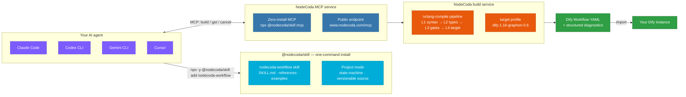

# 让 AI Agent 交付可靠的 Dify 工作流

> **NodeCoda — Workflow Engineering, Upgraded for the AI Era.** Write workflows as versionable source code — your agent designs, builds, diagnoses, and ships production-ready Dify workflows.

**English** · [简体中文](README.zh-CN.md)

[](https://www.npmjs.com/package/@nodecoda/skill)
[](LICENSE)
[](https://www.nodecoda.com)
[](https://www.nodecoda.com)
[]()

**Workflow engineering should feel like coding — not like fighting a drag-and-drop canvas.**

NodeCoda is an AI-native workflow platform. Your AI agent writes workflows as
**versionable source code** (`.ncoda`), and NodeCoda compiles them into
production-ready **Dify Workflow YAML**. Review it in git. Diff it in PRs.
Roll it back like any other code.

This repo is the part that talks to your agent: one command installs the
`nodecoda-workflow` skill into **Claude Code, Codex CLI, Gemini CLI, or
Cursor** and wires up the NodeCoda MCP service. Your agent learns to design,
build, diagnose, and fix Dify workflows on its own.

[👉 Try it live at www.nodecoda.com](https://www.nodecoda.com)

---

## Why NodeCoda?

Because "drag and drop" scales about as well as emailing screenshots around.

| Old way: drag-and-drop | NodeCoda way: code |
|---|---|
| Canvas state can't be diffed or reviewed | Source is plain text — git, PRs, blame, rollback, all of it |
| Collaboration = screenshots + voice calls | Collaboration = review, branch, merge |
| Debugging = clicking through nodes | **Structured diagnostics** + an agent that fixes and retries |
| Every change is a rebuild from scratch | Change a few lines of Source, recompile, done |

**In one line: turn workflow design into code, and your AI agent becomes your workflow engineer.**

## How it works

```
Your agent ──► nodecoda-workflow skill ──► NodeCoda MCP ──► build pipeline ──► Dify Workflow YAML
```



The agent follows the skill's playbook: turn the requirement into `.ncoda`
source → submit an async build over MCP → the pipeline validates
L1→L4 and produces the target workflow → structured diagnostics drive a
fix-and-retry loop until you get a Dify-ready artifact.

## Quick start — 30 seconds

```bash
# 1. install the skill — `add` auto-detects Codex / Claude Code / Gemini /
#    Cursor and auto-registers the `nodecoda` MCP server, so your agent gets
#    the build_dify_workflow tools with zero manual wiring
npx -y @nodecoda/skill add nodecoda-workflow

# 2. get a key, then give it to your agent
#    Sign in at https://www.nodecoda.com → API Keys → create (sk-...)
export NODECODA_KEY=sk-...   # add to your shell profile

# 3. just ask:
#    "Build me a workflow: take a user query and answer with GPT-5.4"
```

That's it. Once installed, your agent knows when and how to call
`build_dify_workflow`, `get_workflow_build`, and `cancel_workflow_build` —
and it will fix its own mistakes when a build fails, using the diagnostics.

## What your agent can do now

- **3 MCP tools** — `build_dify_workflow`, `get_workflow_build`, `cancel_workflow_build`
- **Project mode** — one workflow = one folder (`nodecoda.yaml` + `nodecoda.state.json` + `<name>.ncoda`), with a lifecycle state machine (`INIT → CLARIFYING → DESIGNED → SOURCE_READY → BUILDING → SUCCEEDED`). Interrupted a session? Pick up where you left off.
- **Diagnostics, not mysteries** — every stage (L1→L4) contributes machine-readable diagnostics; the fix loop converges in ≤5 rounds
- **Credentials stay safe** — keys live only in MCP client config, never in source, prompts, or artifacts

A minimal `.ncoda` (4 runnable examples live in `examples/`):

```nodecoda
@language nodecoda/1
@mode workflow

// the classic "main → llm → return" pattern
const MODEL = "openai_api_compatible/gpt-5.4";

function main(string query) -> string {
    let response = llm(MODEL, {
        "messages": [
            { "role": "system", "content": "Answer in one sentence." },
            { "role": "user", "content": query }
        ]
    });
    return response.text;
}
```

## Install

### Option A — one command (recommended)

```bash
npx -y @nodecoda/skill add nodecoda-workflow
```

The CLI detects which agent you're using (Codex, Claude Code, Gemini CLI,
Cursor) and drops the skill in the right place — **and it auto-registers the
`nodecoda` MCP server** (Claude Code via `claude mcp add`, Codex via
`config.toml`, Gemini via `settings.json`, Cursor via `.cursor/mcp.json`), so
your agent gets `build_dify_workflow` & co. with zero manual wiring. Named
targets install user-wide (`~/.claude/skills`, `~/.codex/skills`, ...); pass
any directory for an exact location. Repair the MCP wiring anytime with
`npx -y @nodecoda/skill mcp-register <target>`.

### Option B — manual

```bash
git clone https://github.com/nodecoda/nodecoda-skill.git

# Claude Code
cp -R nodecoda-skill/skills/nodecoda-workflow ~/.claude/skills/

# Codex CLI (project-scoped)
cp -R nodecoda-skill/skills/nodecoda-workflow .codex/skills/

# any agent that follows the Claude Code skill convention
cp -R nodecoda-skill/skills/nodecoda-workflow <skill-search-path>/nodecoda-workflow
```

### Wiring up MCP

- **Zero-install** — `npx -y @nodecoda/skill mcp` (stdio, or `--http` for Streamable HTTP). No clone, no local install.
- **CLI builds (no MCP client, no key)** — `npx -y @nodecoda/skill build <file.ncoda>` submits, polls, and saves the Dify artifact in one step. Transport is picked automatically: no `NODECODA_KEY` → guest JSON-RPC on try.nodecoda.com, key set → www REST. Handy right after `add` when the current session can't load the MCP tools yet.
- **Public endpoint** — `https://www.nodecoda.com/mcp`; the key is read from `NODECODA_KEY` and never written to disk.
- **Self-host / local dev** — [`.codex/config.example.toml`](https://github.com/nodecoda/nodecoda-skill/blob/main/.codex/config.example.toml) ships templates for a local HTTP server, a local dev stack, and a stdio bridge.

Per-agent paths and the Cursor `.mdc` details: **[docs/installation.md](https://github.com/nodecoda/nodecoda-skill/blob/main/docs/installation.md)**.

## Compatibility

| | |
|---|---|
| Skill version | `0.2.7` (versioned independently of NodeCoda core) |
| NodeCoda core | `>= 1.0.0` (`min_nodecoda`) |
| Target profile | `dify-1.16-graphon-0.6` |
| Agents | Claude Code · Codex CLI · Gemini CLI · Cursor (anything following the Claude Code skill convention) |
| Language | NodeCoda Source (`@language nodecoda/1`) |

Releases are **tag-driven**: `git tag v0.2.7 && git push origin v0.2.7` —
the pipeline cross-checks the tag against `manifest.json` and publishes to npm.

## Repository layout

```
nodecoda-skill/
├── skills/nodecoda-workflow/   # the shipped skill
│   ├── SKILL.md                # the protocol your agent follows
│   ├── manifest.json           # version · platforms · target · MCP tools
│   ├── references/             # 8 deep-dive references
│   └── examples/               # 4 runnable .ncoda examples
├── docs/                       # installation & design docs
├── scripts/                    # CLI · MCP servers · project tooling
├── .github/workflows/          # CI + tag-driven release
├── package.json                # @nodecoda/skill (npm)
├── LICENSE · NOTICE            # Apache-2.0
```

## Contributing

See [CONTRIBUTING.md](CONTRIBUTING.md).

- **Skill content** — edit `skills/nodecoda-workflow/`, bump `manifest.json` version, add a `CHANGELOG.md` entry.
- **New skill** — create `skills/<new-skill>/` with its own `SKILL.md` + `manifest.json`; open an issue first to talk it through.

## Ecosystem

| Repo / site | What it is |
|---|---|
| [nodecoda/nodecoda-skill](https://github.com/nodecoda/nodecoda-skill) (this) | Agent skills + MCP distribution — the public entry point |
| [nodecoda/nodecoda](https://github.com/nodecoda/nodecoda) | NodeCoda core: Workspace, MCP, language toolchain, frontend (private) |
| [www.nodecoda.com](https://www.nodecoda.com) | Public cloud: login, API keys, MCP gateway, web workspace |

## License

Apache License 2.0 — see [LICENSE](LICENSE) and [NOTICE](NOTICE).
