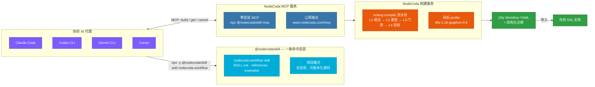

# 让 AI Agent 交付可靠的 Dify 工作流

> **NodeCoda — 为 AI 时代升级的工作流工程。** 把工作流写成可版本化的源码——设计、构建、诊断、交付，全部交给你的 AI 代理。

[简体中文](README.zh-CN.md) · **English** [README.md](README.md)

[](https://www.npmjs.com/package/@nodecoda/skill)
[](LICENSE)
[](https://www.nodecoda.com)
[](https://www.nodecoda.com)
[]()

**工作流工程，应该像写代码——而不是在画布上跟拖拽较劲。**

NodeCoda 是 AI 原生的工作流工程平台。你的 AI 代理把工作流写成**可版本化的源码**（`.ncoda`），NodeCoda 把它编译成生产可用的 **Dify Workflow YAML**。进 git、走 PR review、随时回滚——和普通代码一模一样。

这个仓库是给代理用的那部分：一条命令，把 `nodecoda-workflow` skill 装进 **Claude Code、Codex CLI、Gemini CLI 或 Cursor**，自动接好 NodeCoda MCP 服务。从此你的代理学会了独立完成 Dify 工作流的设计、构建、诊断与修复。

[👉 立即体验 → www.nodecoda.com](https://www.nodecoda.com)

---

## 为什么选 NodeCoda？

因为"拖拽式"的协作方式，约等于"把截图发来发去"。

| 老办法：拖拽画布 | NodeCoda 的方式：写代码 |
|---|---|
| 画布状态没法 diff、没法 review | Source 是纯文本——git、PR、blame、回滚，全都用得上 |
| 协作靠截图 + 语音电话 | 协作靠 review、分支、合并 |
| 排错靠人肉点节点 | **结构化诊断** + 代理自动修、自动重试 |
| 改一次重做一遍 | 改几行 Source，重新编译就完事 |

**一句话：把工作流从"画图"变成"写代码"，AI 才能成为你的工作流工程师。**

## 它是怎么工作的

```
你的 AI 代理 ──► nodecoda-workflow skill ──► NodeCoda MCP ──► 编译流水线 ──► Dify Workflow YAML
```



代理按 skill 的规范干活：把需求写成 `.ncoda` 源码 → 通过 MCP 提交异步构建 → 流水线做 L1→L4 校验并产出目标工作流 → 结构化诊断驱动"修复-重试"循环，直到交付可直接导入 Dify 的 artifact。

## 快速开始 — 30 秒

```bash
# 1. 安装 skill（自动探测 Codex / Claude Code / Gemini / Cursor）
npx -y @nodecoda/skill add nodecoda-workflow

# 2. 配置 API Key
export NODECODA_KEY=sk-...   # 写进你的 shell profile

# 3. 直接吩咐它，例如：
#    "帮我做一个工作流：接收用户问题，用 GPT-5.4 回答"
```

就这么多。装好之后，你的代理知道何时、如何调用
`build_dify_workflow`、`get_workflow_build`、`cancel_workflow_build`——
构建失败时，它还会照着诊断自己修。

## 你的代理从此会什么

- **3 个 MCP 工具** — `build_dify_workflow`、`get_workflow_build`、`cancel_workflow_build`
- **项目模式** — 一个工作流 = 一个目录（`nodecoda.yaml` + `nodecoda.state.json` + `src/*.ncoda`），生命周期状态机 `INIT → CLARIFYING → DESIGNED → SOURCE_READY → BUILDING → SUCCEEDED`；会话断了也不怕，回来接着干
- **诊断而不是玄学** — L1→L4 每个阶段都给出机器可读的诊断，修复循环 ≤5 轮收敛
- **凭据安全** — Key 只存在于 MCP 客户端配置，绝不进入源码、prompt 或 artifact

一段最小的 `.ncoda`（`examples/` 下有 4 个可直接运行的示例）：

```nodecoda
@language nodecoda/1
@mode workflow

// 经典 "main → llm → return" 模式
const MODEL = "openai_api_compatible/gpt-5.4";

function main(string query) -> string {
    let response = llm(MODEL, {
        "messages": [
            { "role": "system", "content": "用一句话回答。" },
            { "role": "user", "content": query }
        ]
    });
    return response.text;
}
```

## 安装

### 方式 A — 一条命令（推荐）

```bash
npx -y @nodecoda/skill add nodecoda-workflow
```

CLI 会自动识别你正在用的代理（Codex、Claude Code、Gemini CLI、Cursor）并落到正确位置。也可以显式指定：`add nodecoda-workflow codex`、`... claude-code`、`... gemini-cli`、`... cursor`，或直接给任意目录。

### 方式 B — 手动

```bash
git clone https://github.com/nodecoda/nodecoda-skill.git

# Claude Code
cp -R nodecoda-skill/skills/nodecoda-workflow ~/.claude/skills/

# Codex CLI（项目级）
cp -R nodecoda-skill/skills/nodecoda-workflow .codex/skills/

# 任何遵循 Claude Code skill 约定的代理
cp -R nodecoda-skill/skills/nodecoda-workflow <skill-search-path>/nodecoda-workflow
```

### 接入 MCP

- **零安装** — `npx -y @nodecoda/skill mcp`（stdio，`--http` 可切 Streamable HTTP）。不用 clone、不用本地安装
- **公网直连** — `https://www.nodecoda.com/mcp`；Key 从 `NODECODA_KEY` 读取，绝不落盘
- **自托管 / 本地开发** — `.codex/config.example.toml` 自带三种模板：本地 HTTP server、本地 dev stack、stdio bridge

各代理的安装路径和 Cursor 的 `.mdc` 细节见 **[docs/installation.md](docs/installation.md)**。

## 兼容性

| | |
|---|---|
| Skill 版本 | `0.2.7`（与 NodeCoda core 独立版本化） |
| NodeCoda core | `>= 1.0.0`（`min_nodecoda`） |
| 目标 profile | `dify-1.16-graphon-0.6` |
| 支持的代理 | Claude Code · Codex CLI · Gemini CLI · Cursor（遵循 Claude Code skill 约定的均可） |
| 语言 | NodeCoda Source（`@language nodecoda/1`） |

发布由 **git tag 驱动**：`git tag v0.2.7 && git push origin v0.2.7`——流水线会校验 tag 与 `manifest.json` 版本一致后发布到 npm。

## 仓库结构

```
nodecoda-skill/
├── skills/nodecoda-workflow/   # 对外发布的 skill
│   ├── SKILL.md                # 代理遵循的工作流协议
│   ├── manifest.json           # 版本 · 平台 · 目标 · MCP 工具
│   ├── references/             # 8 篇深度参考
│   └── examples/               # 4 个可运行的 .ncoda 示例
├── docs/                       # 安装与设计文档
├── scripts/                    # CLI · MCP server · 项目管理
├── .github/workflows/          # CI + tag 驱动发布
├── package.json                # @nodecoda/skill（npm）
├── LICENSE · NOTICE            # Apache-2.0
```

## 参与贡献

见 [CONTRIBUTING.md](CONTRIBUTING.md)。

- **改 skill 内容** — 编辑 `skills/nodecoda-workflow/`，bump `manifest.json` 版本，更新 `CHANGELOG.md`
- **新增 skill** — 在 `skills/<new-skill>/` 下创建，附 `SKILL.md` + `manifest.json`；先开 issue 聊清楚再动手

## 生态

| 仓库 / 站点 | 是什么 |
|---|---|
| [nodecoda/nodecoda-skill](https://github.com/nodecoda/nodecoda-skill)（本仓库） | Agent skill + MCP 分发——对外的入口 |
| [nodecoda/nodecoda](https://github.com/nodecoda/nodecoda) | NodeCoda core：Workspace、MCP、语言工具链、前端（私有） |
| [www.nodecoda.com](https://www.nodecoda.com) | 公有云：登录、API Key、MCP 网关、Web 工作台 |

## License

Apache License 2.0 — 见 [LICENSE](LICENSE) 与 [NOTICE](NOTICE)。
